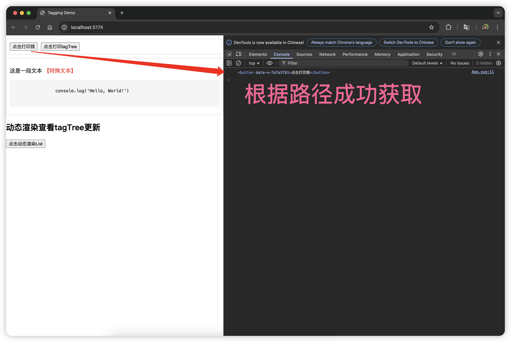

# Tagging 和 Mask 技术实现说明

## Tagging 实现原理说明

1. 上下文管理：

- 使用 `Vue` 的 `provide/inject` 实现嵌套组件通信
- 每个 `Tag` 组件维护自己的子节点列表
- 通过 `onMounted/onBeforeUnmount` 生命周期管理节点注册

2. 树形结构构建：

- 每个 `Tag` 节点包含 `name`、组件实例和子节点
- 父节点自动收集子节点信息
- 使用响应式对象`(reactive)`自动维护树结构

3. 查询机制：

- 使用深度优先搜索遍历 Tag 树
- 支持路径匹配查询（如`"editorbox check"`）
- 返回匹配的 HTMLElement

4. 组件关系：

- `<TagRoot />` 作为根容器和查询入口
- `<Tag />` 组件支持无限嵌套，自动维护层级关系
- 自动处理组件卸载时的节点清理

### 示例组件

```vue
<script setup>
...
const { getElement } = useTag();

const handleCheck = () => {
  const checkbutton = getElement("editorbox check");
  console.log(checkbutton);
};

const logCodeContext = () => {
  const pre = getElement("editorbox pre");
  console.log(pre);
};
</script>

<template>
  <RootTag>
    <Tag name="editorbox">
      <div class="editor">
        <h2>Coding Here</h2>
        <div class="options">
          <Tag name="check">
            <button @click="handleCheck">Check</button>
          </Tag>
          <Tag name="logpre">
            <button @click="logCodeContext">logpre</button>
          </Tag>
        </div>
        <Tag name="pre">
          <pre>
            <Tag name="code">
              <code>console.log("Hello, World!");</code>
            </Tag>
          </pre>
        </Tag>
      </div>
    </Tag>
  </RootTag>
</template>
```

### 控制台运行效果



### 实现原则

- 分层设计：`RootTag` 为根，`Tag` 形成树形结构
- 职责分离：标注组件只管注册，消费组件负责查询
- 响应式树：自动维护节点关系，无需手动更新
- 上下文穿透：支持任意层级的嵌套标注

## Mask 实现原理说明

### 蒙层中的精准挖洞与事件穿透

遮罩组件的挖洞高亮效果主要通过 `​SVG` 路径运算 + 动态定位 ​ 实现，具体分为以下核心步骤：

#### 遮罩层结构设计

```html
<svg class="svg-mask">
  <path :d="svgPath" fill="rgba(0, 0, 0, 0.5)" fill-rule="evenodd" />
</svg>
```

#### 挖洞实现原理

1. `SVG` 路径组合 ​

   通过 `evenodd` 填充规则，将两个路径进行布尔运算：

- 外层路径：全屏黑色半透明矩形（覆盖整个屏幕）
- 内层路径：带圆角的高亮区域矩形（挖洞区域）

```ts
const svgPath = computed(() => {
  const outerRect = `M0,0 H${screenWidth} V${screenHeight} H0 Z`; // 全屏矩形
  const holeRect = createRoundedRectPath(...); // 高亮区域圆角矩形
  return outerRect + " " + holeRect; // 路径组合
});
```

2. ​ 圆角矩形生成函数

`createRoundedRectPath` 使用 SVG 路径命令构建圆角矩形：

```ts
function createRoundedRectPath(x, y, w, h, r) {
  // 使用四次贝塞尔曲线绘制圆角
  return `
    M${x + r},${y}
    H${x + w - r} Q${x + w},${y} ${x + w},${y + r}
    V${y + h - r} Q${x + w},${y + h} ${x + w - r},${y + h}
    H${x + r} Q${x},${y + h} ${x},${y + h - r}
    V${y + r} Q${x},${y} ${x + r},${y} Z
  `;
}
```

### 高精度、低冗余的元素监听

自定义 `Hook` `useElementRect` 通过多维度监听策略实现了对元素位置和尺寸变化的实时响应，其协作机制可以分为以下核心模块：

#### 响应式数据与基础更新逻辑

1. `rect` 响应式变量

   通过 `ref` 存储当前元素的 `DOMRect` 值，当元素尺寸或位置变化时，触发 `Vue` 的响应式更新。

2. `updateRect` 函数

   对比新旧 `DOMRect` 值，仅当关键属性（`top/left/width/height`）变化时才更新 `rect.value`，避免不必要的触发。

#### 四大监听策略协同工作

通过以下四类观察器覆盖所有可能引发元素位置变化的场景：

1. `ResizeObserver`

   监听元素内容区域尺寸变化（如窗口缩放、内容增减导致的尺寸变化），触发 `updateRect`。

2. `MutationObserver`

   监听元素`style` 或 `class` 属性变化（如 `CSS` 动画、手动修改样式），触发 `updateRect。

3. `IntersectionObserver`

   监听元素 进入/离开视口或滚动容器 时的位置变化，触发 `updateRect`。

4. 轮询检测（`requestAnimationFrame`）​

   通过 `pollPosition` 函数持续轮询元素位置，捕捉 `​CSS` 变换（如 `transform`）​​ 等无法被上述观察器捕获的变化。

#### 生命周期与资源清理

1. `watch` 监听元素引用:

   当 `elSource` 指向的元素改变时，自动销毁旧观察器实例，重新初始化新元素的监听。

2. `onCleanup` 销毁逻辑 :

   在元素卸载或变更时，依次调用：

- `resizeObserver.disconnect()`
- `mutationObserver.disconnect()`
- `intersectionObserver.disconnect()`
- 取消轮询的 `cancelAnimationFrame` 避免内存泄漏。

3. 组件卸载处理

   通过 `onBeforeUnmount` 确保组件销毁时取消所有动画帧请求。

#### 性能优化策略

1. 防抖对比

   `updateRect` 通过对比新旧 `DOMRect` 的四个关键属性，避免重复触发无关更新。

2. 按需轮询

   仅在元素存在时启动 `requestAnimationFrame` 轮询，通过 `cancelPoll` 函数动态管理资源。
