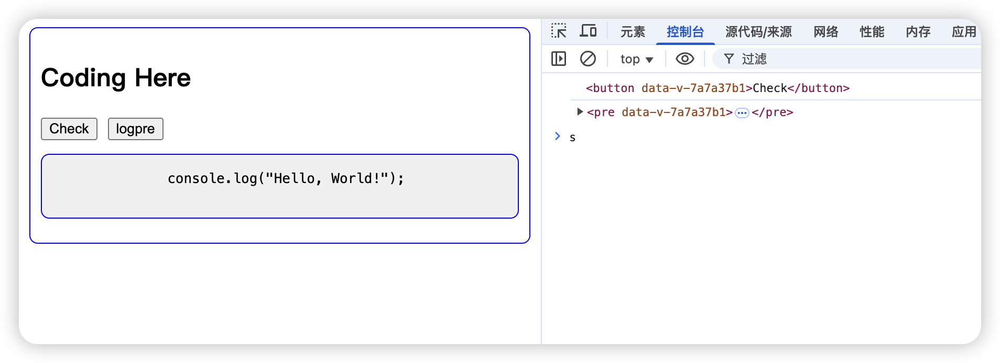

# Tagging

## 实现原理说明

1. 上下文管理：

- 使用 `Vue` 的 `provide/inject` 实现嵌套组件通信
- 每个 `Tag` 组件维护自己的子节点列表
- 通过 `onMounted/onBeforeUnmount` 生命周期管理节点注册

2. 树形结构构建：

- 每个 `Tag` 节点包含 `name`、组件实例和子节点
- 父节点自动收集子节点信息
- 使用响应式对象`(reactive)`自动维护树结构

3. 查询机制：

- 使用深度优先搜索遍历 Tag 树
- 支持路径匹配查询（如`["infoBox", "confirm"]`）
- 返回匹配的组件实例，可直接访问 DOM 元素

4. 组件关系：

- `TagConsumer` 作为根容器和查询入口
- `Tag` 组件支持无限嵌套，自动维护层级关系
- 自动处理组件卸载时的节点清理

## 架构设计图


## 示例

#### 示例组件

```vue
<!-- App.vue -->
<script setup>
import { ref } from "vue";

const consumerRef = ref();

function log() {
  const instance = consumerRef.value?.find(["infoBox", "confirm"]);
  console.log(instance.subTree.children[0].el);
}

function logTree() {
  const tree = consumerRef.value?.getTagTree();
  console.log(tree);
}
</script>

<template>
  <TagConsumer ref="consumerRef">
    <Tag name="infoBox">
      <div class="info-box">
        <Tag name="confirm">
          <button @click="log">点击打印我</button>
          <button @click="logTree">点击打印tagTree</button>
        </Tag>
      </div>
    </Tag>
    <Tag name="textBox">
      <div class="info-box">
        <Tag name="text">
          <p>
            这是一段文本
            <Tag name="special">
              <span>特殊文本</span>
            </Tag>
          </p>
          <Tag name="code">
            <pre>
              <code>
                console.log('Hello, World!')
              </code>
            </pre>
          </Tag>
        </Tag>
      </div>
    </Tag>
    <ClickToRender />
  </TagConsumer>
</template>
```

```vue
<!-- ClickToRender.vue -->
<script setup lang="ts">
import Tag from "./Tag.vue";
import { ref } from "vue";
const list = ref([""]);

function renderList() {
  list.value = ["A", "B", "C"];
}
</script>

<template>
  <div>
    <h2>动态渲染查看tagTree更新</h2>
    <button @click="renderList">点击动态渲染List</button>
    <div>
      <Tag name="list">
        <div>
          <Tag :name="item" v-for="item in list" :key="item">
            <div>{{ item }}</div>
          </Tag>
        </div>
      </Tag>
    </div>
  </div>
</template>
```

#### 控制台运行效果

1. 根据`["infoBox", "confirm"]`路径查找目标组件



2. 查看`tagTree`


3. 自动跟踪组件树更新


## 实现原则

- 分层设计：`TagConsumer` 为根，`Tag` 形成树形结构
- 职责分离：标注组件只管注册，消费组件负责查询
- 响应式树：自动维护节点关系，无需手动更新
- 上下文穿透：支持任意层级的嵌套标注
